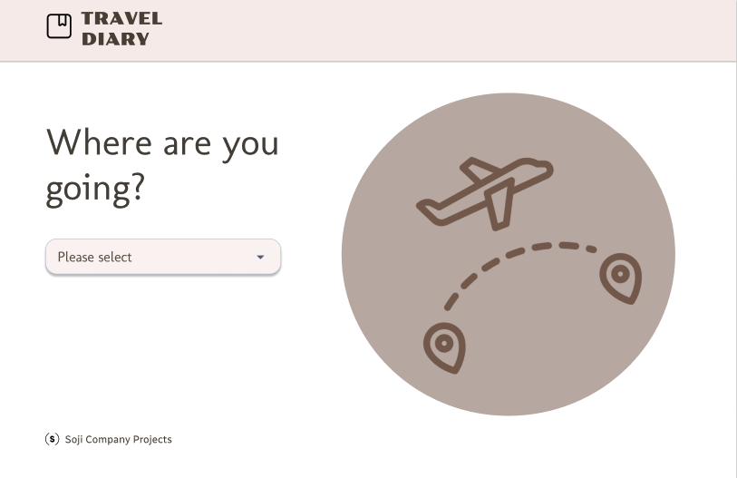
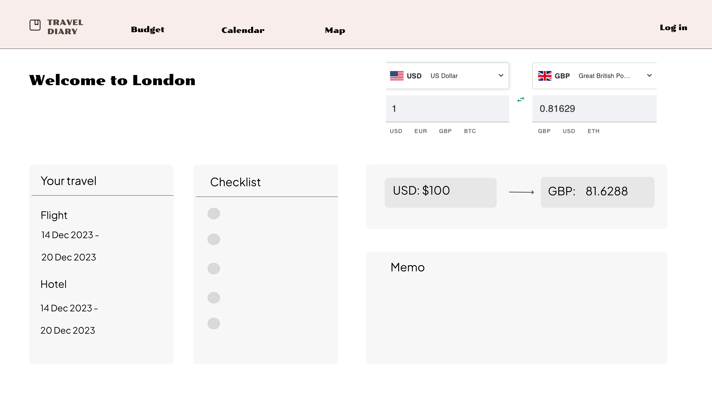
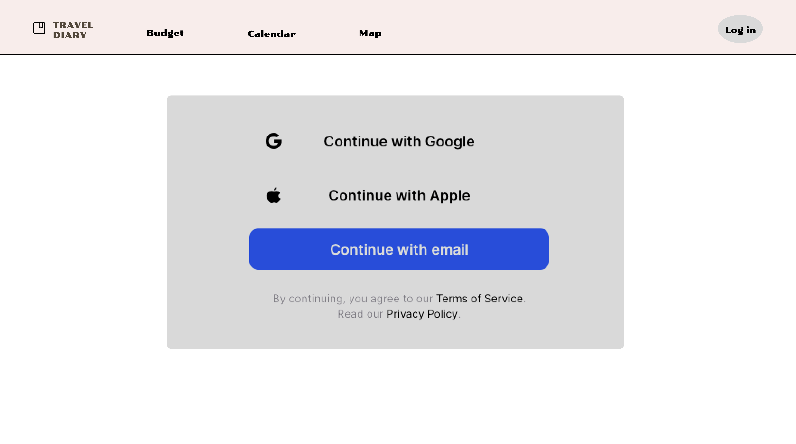
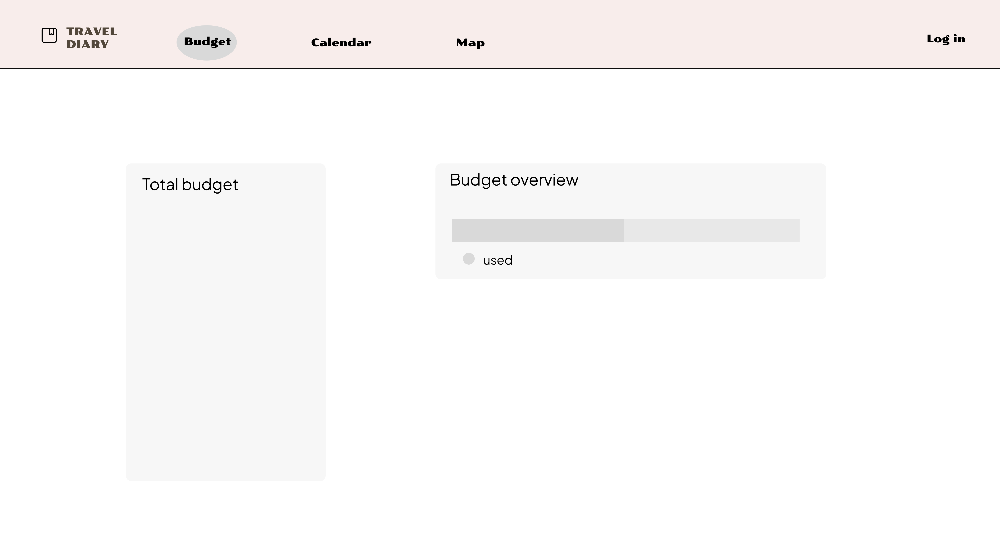
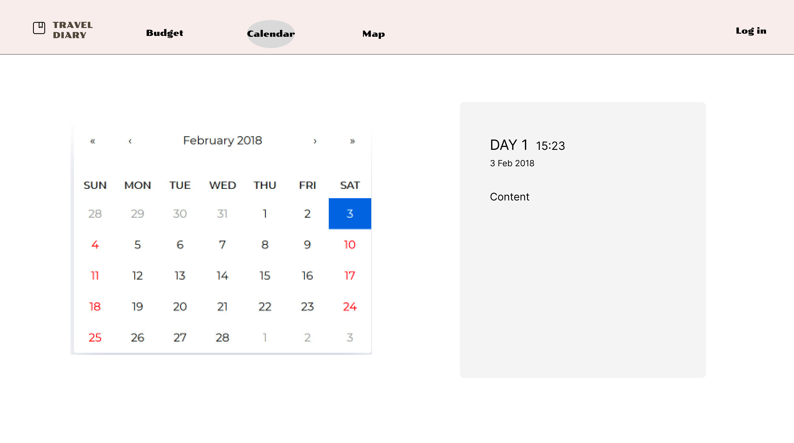
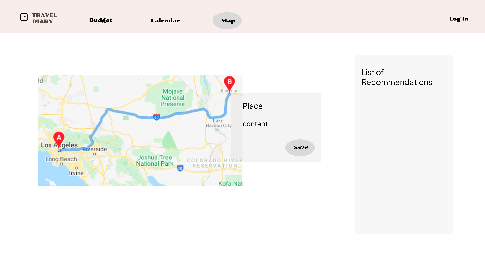
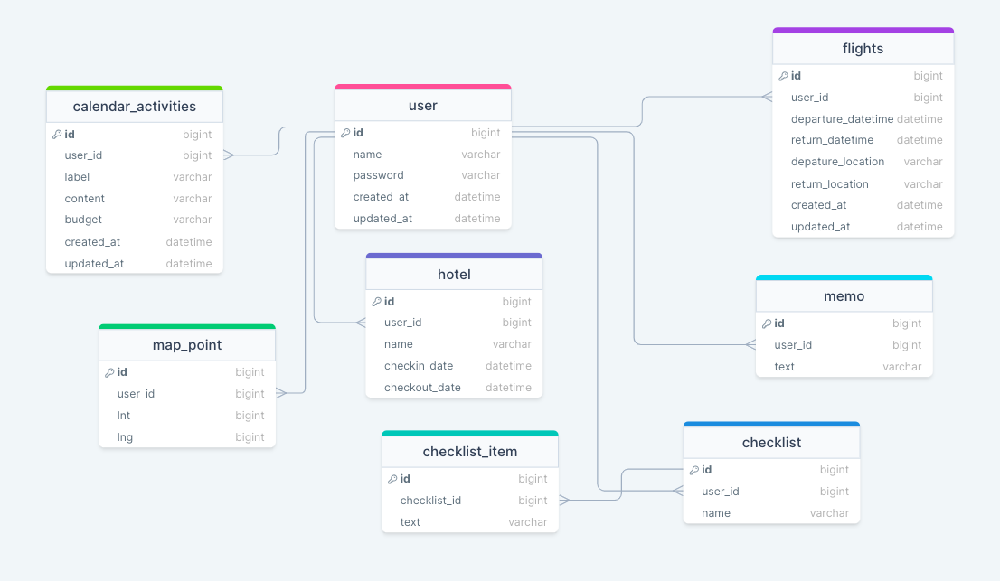

# Project Title

- Travel Diary

## Overview

- Travel Diary offers features such as currency conversion, budget tracker, organizing trip plans with a calender feature and saving places-to-go & creating routes on a map.

### Problem

- When traveling abroad, I often find it challenging to figure out how much this price is if I convert it into my country's currency. While there are many currency conversion apps available, I've tended to discontinue using due to their limited functionality. This led me the idea of a travel app that not only facilitates currency conversion but also have additional features like budget tracking, savings plans and places to visit.

### User Profile

- Travelers, international students and workers will be user. They can benefit from this app which will help them manage their finances and trip plans efficiently during their stay.

### Features

- Currency Conversion:
  Users can convert currencies easily within the app.

- Expanses Tracker:
  Users can input their total budget and track it. They can save their expenses along with details, and the app provides real-time updates on their budget status, allowing for better financial management during the trip.

- Organizing Trip Plans with Calendar Feature:
  Users can plan and organize their trips through a calendar feature.

- Saving Places-to-Go & Creating Routes on a Map:
  Users can save desired place-to-go and create routes on a map. The app also offers a list of recommended places and user can save a recommended place.

- Saving Booking Information:
  The app allows users to save essential booking details for flights, hotels, and other reservations.

- Checklist Creation:
  Users can create and manage checklists to ensure they have everything they need for their trip.

- Memo saving:
  Users can create and manage memos.

## Implementation

### Tech Stack

- Sass, React(+Router), Axios, Node.js, Express, Knex.js and more ....

### APIs

- map npm, calender npm, currency conversion api, real-time data api, attractions api and more ...

### Sitemap

- Country Selection Page:
  Users begin selecting the country they plan to travel to.

- Main Page(Dashborad):
  This page displays the user's trip information(if logged in), current currency information, a checklist and a memo.

- Login page: (pop-up)
  This page offers a secure entry point with Google authentication.

- Budget Page:
  This page covers budget real-time tracking.

- Calendar Page:
  User can save and organize their trip plans using the calendar feature on this page.

- Map Page:
  This page allows users to save desired places-to-go, create routes on a map and also provides a list of recommended places to explore.

### Mockups

First page:

!

### Data

### Endpoints

1. Country Selection Page: /country

<!-- - HTTP Method: POST
- Parameters: Selected Country
- Successful Response:
  "status": "success",
  "message": "Country selection successful. Redirecting to the Main Page."
- Error Response:
  "status": "error",
  "message": "Unable to save country selection. Please try again." -->

2. Main Page: /home

<!-- - HTTP Method: Get (for trip information and currency data)
- Parameters: Google Authentication Token
- Successful Response:
  "status": "success",
  "message": "Main Page data retrieved successfully."
- Error Response:
  "status": "error",
  "message": "Unable to load Main Page. Please try again later."

- HTTP Method: POST (for creating a new checklist and memo)
- Parameters: Google Authentication Token, Checklist Item & Memo Content
- Successful Response:
  "status": "success",
  "message": "Checklist item created successfully." or "Memo created successfully."
- Error Response:
  "status": "error",
  "message": "Unable to save. Please try again later."

- HTTP Method: PUT (for updating a checklist and memo)
- Parameters: Google Authentication Token, Checklist Item or Memo ID & Updated Checklist Item or Memo
- Successful Response:
  "status": "success",
  "message": "Checklist item updated successfully." or "Memo updated successfully."
- Error Response:
  "status": "error",
  "message": "Unable to update. Please try again later."

- HTTP Method: DELETE (for deleting a checklist and memo)
- Parameters: Google Authentication Token, Checklist Item or Memo ID
- Successful Response:
  "status": "success",
  "message": "Checklist item deleted successfully." or "Memo deleted successfully."
- Error Response:
  "status": "error",
  "message": "Unable to delete. Please try again later." -->

3. Login Page: /login
<!--

- HTTP Method: POST
- Parameters: Google Authentication Token
- Successful Response:
  "status": "success",
  "message": "Login successful"
- Error Response:
  "status": "error",
  "message": "Invalid Google authentication. Please try again." -->

4. My Trip Page: /my-trip

<!-- - HTTP Method: POST
- Parameters: Google Authentication Token, Trip Information
- Successful Response:
  "status": "success",
  "message": "Trip information saved successfully."
- Error Response:
  "status": "error",
  "message": "Unable to save trip information. Please try again." -->

5. Finance Page: /finance

<!-- - HTTP Method: GET
- Parameters: Google Authentication Token
- Successful Response:
  "status": "success",
  "message": "Finance data retrieved successfully."
- Error Response:
  "status": "error",
  "message": "Unable to load Finance Page. Please try again later." -->

6. Calendar Page: /calender
<!--

- HTTP Method: GET
- Parameters: Google Authentication Token
- Successful Response:
  "status": "success",
  "message": "Calendar data retrieved successfully."
- Error Response: "Unable to retrieve Calendar data. Please try again later."

- HTTP Method: POST (for saving trip plans)
- Parameters: Google Authentication Token, Trip Plan Information
- Successful Response:
  "status": "success",
  "message": "Trip plan saved successfully."
- Error Response:
  "status": "error",
  "message": "Unable to save trip plan. Please try again."

- HTTP Method: PUT (for updating trip plans)
- Parameters: Google Authentication Token, Trip Plan ID & Updated Trip Plan Information
- Successful Response:
  "status": "success",
  "message": "Trip plan updated successfully."
- Error Response:
  "status": "error",
  "message": "Unable to update trip plan. Please try again."

- HTTP Method: DELETE (for deleting trip plans)
- Parameters: Google Authentication Token, Trip Plan ID
- Successful Response:
  "status": "success",
  "message": "Trip plan deleted successfully."
- Error Response:
  "status": "error",
  "message": "Unable to delete trip plan. Please try again." -->

7. Map Page: /map

<!-- - HTTP Method: GET
- Parameters: Google Authentication Token
- Successful Response:
  "status": "success",
  "message": "Map data retrieved successfully."
- Error Response:
  "status": "error",
  "message": "Unable to retrieve Map data. Please try again later."

- HTTP Method: POST (for saving places-to-go)
- Parameters: Google Authentication Token, Place Information
- Successful Response:
  "status": "success",
  "message": "Place saved successfully."
- Error Response:
  "status": "error",
  "message": "Unable to save place. Please try again."

- HTTP Method: PUT (for updating places-to-go's details)
- Parameters: Google Authentication Token, Place ID & Place ID
- Successful Response:
  "status": "success",
  "message": "Place updated successfully.",
- Error Response:
  "status": "error",
  "message": "Unable to update place. Please try again."

- HTTP Method: DELETE (for deleting places-to-go)
- Parameters: Google Authentication Token, Place ID
- Successful Response:
  "status": "success",
  "message": "Place deleted successfully."
- Error Response:
  "status": "error",
  "message": "Unable to delete place. Please try again." -->

### Auth

- Authentication will be included using JWT. (log in using Email)

## Roadmap

1. Sprint-1 (Duration: first week):
   Establish the foundational structure of the app, including creating pages & components & any necessary codes to build a basic frame.

- Identify and create necessary pages (Country Selection, Main Page, Budget Page, Calendar Page, Map Page).
- Develop essential components for each page.
- Set up basic navigation between pages.
- Write initial code structure for the app.

2. Sprint-2 (Duration: first week):
   Build a database and integrate necessary APIs for functionality.

- Create a back-end.
- Identify and get APIs for currency conversion, real-time data api, tour attractions & any other external functionalities.

3. Sprint-3 (Duration: second week):
   Fetch data from the back-end to populate the app's pages.

- Set up data retrieval for each pages.
- Construct codes to display data on relevant pages.
- Conduct error handling and debugging.

4. Sprint-4 (Duration: second & last week):
   Style the app for an attractive and user-friendly experience.

- Create a consistent and visually appealing design for each page.
- Implement responsive design to accommodate various devices.

## Nice-to-haves

- Price Tag Detection:
  Description: A feature where users can upload images of price tags(or shows it through camera like QR code), and the app will detect the price, displaying it in the converted currency.
  Implementation: Utilize optical character recognition (OCR) & data extraction technology to extract the price and convert it into current currency.

- Information Page:
  Description: Create a page providing comprehensive information about the selected destination such as weather updates and transportation details.
  Implementation: Utilize relevant APIs to fetch real-time weather data and transportation information for the specified location.

- Social media authentication service.

- Korean version
